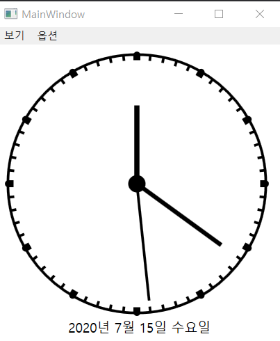
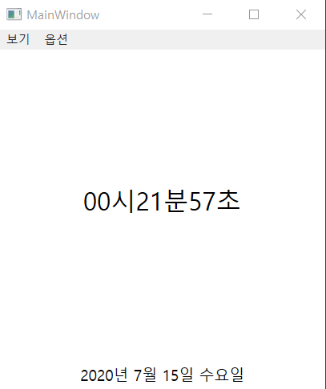

# Digital-Analog_Clock
> 학부생 2학년 1학기 때 C# WPF로 개발한 디지털, 아날로그 시계 프로그램

## Installation

-

## Usage example

닷넷 프레임워크를 이용한 디지털 아날로그 시계 프로그램 개발

## Development setup

IDE: Visual Studio 2019

Framework: .Net 4.7

## Release History

* 1.0.0
    * first commit
    * 개발 완료

## Meta

김준혁 – wnsgur1198@naver.com

## Contributing

1. Fork it (<https://github.com/yourname/yourproject/fork>)
2. Create your feature branch (`git checkout -b feature/fooBar`)
3. Commit your changes (`git commit -am 'Add some fooBar'`)
4. Push to the branch (`git push origin feature/fooBar`)
5. Create a new Pull Request

<!-- Markdown link & img dfn's -->
